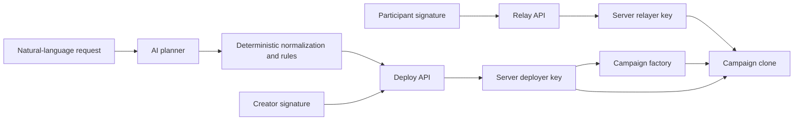
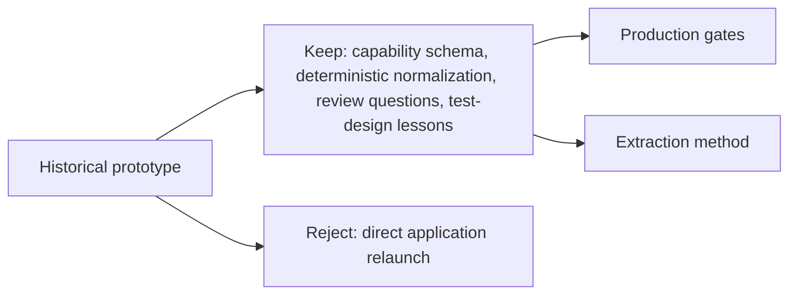

# Forensic Review of My Own Prototype

## Scope

This is the detailed technical chapter behind [README vs Reality](README.md). It reviews a prototype I built and own, at one exact commit, using static read-only analysis.

I am specific here precisely because the source is mine. Nothing in this document evaluates or characterises anyone else's project.

## What the system was

A prompt-to-application prototype. It translated a natural-language campaign request into a structured plan, selected from a fixed set of smart-contract templates, normalized the output, applied deterministic checks, and supported gas-sponsored deployment and participation on an EVM-compatible chain.

## Reviewed state

| Field | Evidence |
|---|---|
| Ownership | author-owned canonical source, private repository |
| Reviewed commit | `5380abd721be248ce5a159d26758a2b7fcb0df3c` |
| Reachable commits | 104 |
| Commit period | 2026-03-20 through 2026-05-13 |
| Active planner templates | 10 |
| Solidity source files | 13 total; 12 implementation files plus the factory |
| Test corpus | 13 test files containing 262 static `it(...)` or `test(...)` declarations |
| Execution boundary | static, read-only; no build, test, deployment, signature, or transaction executed |

**VERIFIED FACT:** these numbers were reproduced from the exact reviewed commit. The 262 declarations are not 262 passing tests.

## What was technically credible

Rejecting a system is only honest if you can say what was right about it.

### Structured planning instead of unconstrained generation

**VERIFIED FACT:** the planner did not synthesize arbitrary Solidity. It selected among ten known templates and returned a structured configuration that application code normalized and checked. The architect layer defined supported use cases, selection rules, a fallback for unsupported requests, and a strict structured output.

**LESSON:** separate probabilistic interpretation from deterministic enforcement. The model may propose; typed and testable code must decide what is allowed. Constraining an AI planner to a finite capability schema is far easier to inspect than treating generated code as trusted output. This was the strongest reusable idea in the source, and it is the one thing I would carry forward.

### A broad, inspectable test design

**VERIFIED FACT:** thirteen test files contained 262 static declarations across factory and implementation behaviour.

**LESSON:** the source showed serious intent to specify behaviour. Operational truth still requires executing those tests in a reproducible environment and publishing the result. Declaration count is an inventory metric, not a quality verdict.

### Real integration work

**VERIFIED FACT:** the source included a full-stack application, a factory and template suite, API routes, relayer and deployer clients, event indexing, read models, and explorer links.

**LESSON:** the failure was not absence of implementation. It was a mismatch between product claims and the trust and economic boundaries the implementation actually enforced.

## Trust-boundary reconstruction

The API verified some signatures and freshness checks. The contracts remained the final authority. The review therefore asked one question repeatedly: **do the contract entry points independently enforce the same identity and action guarantees the API checked?**

Mostly, they did not.

## Findings

| Classification | Evidence at the reviewed state | Production consequence | Extracted lesson |
|---|---|---|---|
| **Attribution boundary** | the factory accepted a nonzero creator address from its caller without binding it to `msg.sender` or a contract-verified authorization | campaign attribution depended on the trusted API path rather than the final mutation boundary | bind principal, action, target, parameters, chain and domain, nonce, and expiry where state changes |
| **Participation boundary** | campaign participation methods accepted a user address while the API performed the signature check and a server relayer submitted the transaction | direct contract behaviour did not independently prove the named user authorized the action | a server check is not an on-chain invariant |
| **Role concentration** | campaign clones were initialized with the server deployer wallet as owner, and server-held keys sponsored deployment, participation, and lifecycle actions | compromise or outage concentrated ownership and operational authority despite creator-facing attribution | enumerate roles and minimize each key's authority before implementation |
| **Lifecycle authorization scope** | creator lifecycle messages bound contract, action, and optional result, but included no nonce, expiry, chain, or explicit domain version | valid signed intent lacked strong replay and cross-context boundaries | authorization formats are protocols and require explicit replay domains |
| **Raffle entropy** | winner selection derived from recent block data, timestamp, and participant count | not a defensible source of unpredictable, manipulation-resistant randomness | specify oracle and randomness guarantees before choosing an implementation |
| **Auction semantics** | bids were declared numbers with no asset custody, and the creator could choose any registered bidder | the system recorded intent but did not enforce settlement or a highest-bid outcome | name recorded intent honestly and model settlement separately |
| **Reputation semantics** | a participant supplied a bounded weight that was added to the selected option | a bounded input was presented as reputation without an authenticated reputation source | validation of shape is not validation of meaning |
| **Index provenance** | indexed campaigns stored a placeholder block number of `"0"` | chronology and event provenance could not support reliable reconciliation | indexes need an authoritative origin, cursor, replay, and repair model |

These describe architectural risk. They deliberately exclude credentials, deployment secrets, exploit payloads, and step-by-step abuse instructions.

## Claim-to-reality corrections

### "AI builds a dApp"

**VERIFIED FACT:** AI interpreted the prompt and selected and configured a fixed template. Deterministic application code and prewritten contracts performed the actual deployment behaviour.

**LESSON:** a narrower description, "AI-assisted configuration of reviewed templates", would have been more accurate and considerably easier to secure. The broader claim was not a lie I told deliberately; it was a claim I never tested against my own code.

### "Gas-sponsored user actions"

**VERIFIED FACT:** the application used server-held relayer infrastructure and user signatures to submit transactions without user-paid gas.

**FAILURE:** the security claim depended on the API path, because several contracts accepted caller-supplied participant identity.

**LESSON:** sponsorship and authorization are different responsibilities. Gas payment by a relayer must not make the relayer the sole enforcement boundary.

### "Audited before deployment"

**VERIFIED FACT:** the application applied deterministic compatibility and configuration checks and included a large static test corpus.

**FAILURE:** these checks did not amount to an adversarial contract security audit, and the review did not execute the tests.

**LESSON:** name a validator according to what it proves. Schema and compatibility validation are useful. They do not establish contract safety.

## Why relaunch was the wrong answer

Reusing the application boundary would preserve the assumptions that were actually wrong: server-centred authority, template behaviours whose economics were descriptive rather than enforceable, and a framing broader than the implementation.

Cosmetic repair does not solve that mismatch. If a rebuild were ever warranted, the correct boundary would be reasoning before code, not faster generation and deployment.

**DECISION:** preserve the prototype as an owned historical source. Do not relaunch the application. The durable outputs are this review, the [production gates](production-gates.md), and the [extraction method](method.md).

## Evidence limits

- The review was static and read-only.
- No dependency installation, build, test, deployment, signature, or state-changing transaction was executed.
- The reviewed commit is the canonical research snapshot, not a claim about the exact state at every historical demo.
- The source repository is private, so the commit reference is author-controlled evidence rather than independently verifiable.
- **The application was decommissioned before this review was published.** The hosted frontend, builder, and relayer API no longer serve traffic. Contracts previously deployed on-chain are immutable and remain on-chain; this document describes design decisions in them, not a reachable service.
- No claim is made about current exploitability.
- Findings describe one prototype. They are not a general claim about AI code generation, template-based deployment, or any other system.
