# Project Extraction Method

## A finite workflow for deciding what survives an old project portfolio

This is the method behind [README vs Reality](README.md). It is written to be run on your own portfolio, not to describe anyone else's.

This method applies to hackathon submissions, abandoned side projects, rushed prototypes, experimental repository portfolios, and acquisition or revival reviews. Its purpose is not to find a reason to keep every project. Its purpose is to extract the maximum defensible value, preserve only what matters, form a small successor portfolio, and close the research workspace.

```mermaid
flowchart LR
    Intake --> Identity["Identity and provenance"]
    Identity --> Audit["Claim-to-reality audit"]
    Audit --> Compare["Comparative tournament"]
    Compare --> Value["Multi-lane value"]
    Value --> Rights["Rights path"]
    Rights --> Fate["Source disposition"]
    Fate --> Preserve["Document, prune, preserve"]
    Preserve --> Form["Project formation"]
    Form --> Close["Close research"]
```

## Evidence language

Use a controlled vocabulary so conclusions do not outrun evidence:

| Label | Meaning |
|---|---|
| `VERIFIED FACT` | directly supported by source, history, metadata, or an observed artifact |
| `INFERENCE` | the most likely explanation of verified facts |
| `HYPOTHESIS` | plausible, but still requiring a test |
| `RECOMMENDATION` | an action derived from evidence and tradeoffs |
| `UNKNOWN` | unresolved after bounded investigation |

Record exact URLs, commits, dates, branches, tags, licenses, paths, and commands when they materially support a conclusion. A README claim is evidence of intent, not proof of implementation.

## The five ledgers

A durable review needs five distinct records. They may be tables, YAML, a database, or concise documents, but the decisions must not be collapsed.

1. **Source inventory:** every observed repository, archive, deployment, deck, screenshot, or related artifact.
2. **Identity and provenance map:** canonical project, duplicates, forks, companions, ownership, exact state, and uncertainty.
3. **Rights matrix:** repository and file-level licenses, attribution, permission needs, contamination, and the resulting execution path.
4. **Audit and value matrix:** claims, implementation, product evidence, multi-lane value, and comparative position.
5. **Disposition and lineage ledger:** source fate, preserved evidence, deletion status, successor dependencies, and final project locations.

## Phase 1: Intake without assuming identity

Collect owned sources, competitors, winners, official directories, demos, deployments, decks, local copies, archives, documentation, judging evidence, and related repositories.

Do not assume a folder or repository name is the product identity. Do not clone everything immediately. Start with read-only metadata, trees, history, licenses, and public evidence, then deepen only where the result could change a decision.

## Phase 2: Resolve identity and provenance

For every source, determine:

- canonical project and source;
- same-submission, companion, fork, mirror, copied-template, renamed, or unrelated relationships;
- current default branch and exact reviewed commit;
- event-period activity and exact judged-state uncertainty;
- owner and contributor identity;
- repository-wide and file-level rights;
- local-only history or source contamination;
- deployment-only or unavailable-source status.

Deduplicate at the project level before calculating counts or ranking candidates.

## Phase 3: Compare claims with implementation

Review the whole path required to make each important claim true:

`claim -> enforcing component -> identity -> authorization -> state change -> value or proof -> operations`

Inspect architecture, frontend, backend, contracts, AI claims, infrastructure, CI/CD, authentication, privacy, custody, settlement, oracles, accounting, replay, idempotency, economic invariants, tests, deployments, buyer evidence, differentiation, and modernization burden as applicable.

Run code only when static evidence is insufficient and isolated execution could materially change the conclusion. Inspect lifecycle scripts first, use an exact-state disposable copy, provide no real credentials, and distinguish declared tests from executed results.

## Phase 4: Hold a comparative tournament

Do not score every repository in isolation. Across the full candidate set, identify:

- strongest product problem and buyer story;
- strongest technical implementation and architecture;
- strongest standalone subsystem;
- strongest open-source opportunity;
- strongest portfolio and security-research story;
- strongest clean-build opportunity;
- duplicated concepts and copied foundations;
- strong ideas hidden behind weak implementation;
- weak ideas hidden behind polished presentation.

Use bounded triage to reject obvious emptiness, templates, duplication, and irrelevance cheaply. Reserve deep audits for candidates whose unique value, disappearance risk, or uncertainty could change the portfolio.

## Phase 5: Separate value from rights

Evaluate intrinsic value first:

- commercial product;
- open-source subsystem;
- portfolio or case study;
- research and failure-mode knowledge;
- historical preservation.

Then assign an execution path:

- self-owned reuse;
- reuse under an explicit compatible license;
- conditional or attribution-bearing reuse;
- written permission required;
- clean independent reimplementation;
- idea or reference only;
- private research only.

A missing license constrains copying and redistribution; it does not prove that the idea has no value. Rebranding or extensive modification does not erase third-party rights.

## Phase 6: Give every source an operational fate

Use one source fate per distinct project:

| Fate | Meaning |
|---|---|
| `ACTIVE_SOURCE` | an owned source remains operationally relevant |
| `ARCHIVE_SOURCE` | exact or sanitized private preservation is justified |
| `ABSORB_THEN_DROP` | capture useful evidence or lessons, then remove the working source |
| `REFERENCE_ONLY` | durable provenance and findings are sufficient; no clone is needed |
| `DROP_DELETE` | no future dependency justifies retention |

Temporary unresolved states need an exact reason, owner, next verification, and stop date.

## Phase 7: Document before deleting

Before removing source material, capture canonical URL, exact commit, provenance, rights, relationships, findings, unique local history, successor dependencies, and portfolio evidence. Then remove unused clones, duplicates, templates, temporary checkouts, generated snapshots, caches, build output, archives without preservation value, and stale exports.

Reference value does not require a working clone.

## Phase 8: Preserve selectively

Private archival is justified only when URL plus commit is not enough because of strategic lineage, unique history, disappearance risk, local-only evidence, major portfolio importance, or future verification needs.

Before remote archival, scan the complete Git object graph for credentials, keys, tokens, private data, and sensitive endpoints. If history contains secrets, do not push it directly. Sanitize the affected history, preserve an old-to-new mapping privately, exclude credential-bearing objects, and verify the remote object graph.

An archive is custody, not ownership, permission, or project continuation.

## Phase 9: Form projects, not themes

Historical projects and capability categories are inputs. A successor project exists only when all of these are concrete:

| Required field | Test |
|---|---|
| User | Who performs the workflow? |
| Buyer or adopter | Who commits money, time, or dependency? |
| Painful current workflow | What happens today and why is it costly? |
| Proposed workflow | What are the input, processing steps, and output? |
| Deliverable | What does the user receive or operate? |
| Differentiation | Why choose this over current alternatives? |
| Lineage | Which sources supplied code, concepts, or lessons? |
| Rights path | Owned reuse, licensed reuse, permission, or clean build? |
| Scope and type | Product, experiment, OSS, private tool, portfolio, or case study? |
| Visibility | Public, private, or mixed? |
| Repository timing | Now, after validation, or none? |
| Kill criterion | What evidence stops the project? |

If these cannot be answered, keep the item as a capability, lesson, or hypothesis. Do not create a repository for it.

## Phase 10: Minimize the successor portfolio

Merge proposals only when they share user, buyer, problem, workflow, deliverable, architecture, value proposition, and maintenance story. Keep them separate when combination would produce a vague platform.

Prefer a few coherent projects over repository sprawl. Demand validation should precede expensive implementation for commercial hypotheses. Public OSS needs a real developer problem, tests, documentation, deliberate licensing, and a maintenance owner. Portfolio work should optimize for technical credibility rather than invented traction.

## Phase 11: Name and design repositories only after formation

After a proposal passes formation, research its category, competitors, naming territory, and collisions. Then decide visibility, history policy, license, branch model, README, CI, security policy, contribution model, homepage, and release model.

Do not carry an old hackathon identity forward automatically, and do not create empty repositories to preserve optionality.

## Phase 12: Close the research workspace

The final evidence base should state:

- every source fate;
- every archive and deletion;
- source-to-successor lineage;
- final project slate and locations;
- unresolved limits;
- why each decision was made.

Ongoing product, OSS, validation, and publication work then moves to successor workspaces. Research ends instead of becoming a permanent excuse to postpone execution.

## How the method generalizes

| Context | Production-truth emphasis |
|---|---|
| Web3 | authority, custody, settlement, oracles, replay, economic invariants |
| AI products | data provenance, evaluation evidence, model boundaries, privacy, human override, unit economics |
| SaaS prototypes | tenancy, authentication, billing, data lifecycle, operations, buyer workflow |
| Infrastructure tools | privileges, failure domains, rollback, state drift, support and maintenance |
| Acquisition review | ownership, dependencies, revenue quality, operational concentration, transferability |

The domain checks change. The durable structure does not: identify the exact thing, test claims against reality, separate value from rights, prune sources, form real successors, and close.

## Adversarial closeout

Before finalizing, ask:

- Are we rewarding sunk cost or event prestige?
- Did a missing license become a shortcut for rejecting intrinsic value?
- Is a clean rebuild merely a cleaner version of a bad product?
- Does the proposed OSS asset have a real user and maintainer?
- Is blockchain, AI, or another fashionable component necessary?
- Are static declarations being described as executed evidence?
- Are we keeping a clone because deletion feels irreversible despite durable provenance?
- Does the successor have a workflow and deliverable, or only a category name?
- Did the owner's project receive the same standard as third-party sources?
- Can the research workspace now close?

Correct the record when the skeptical answer changes a conclusion.
